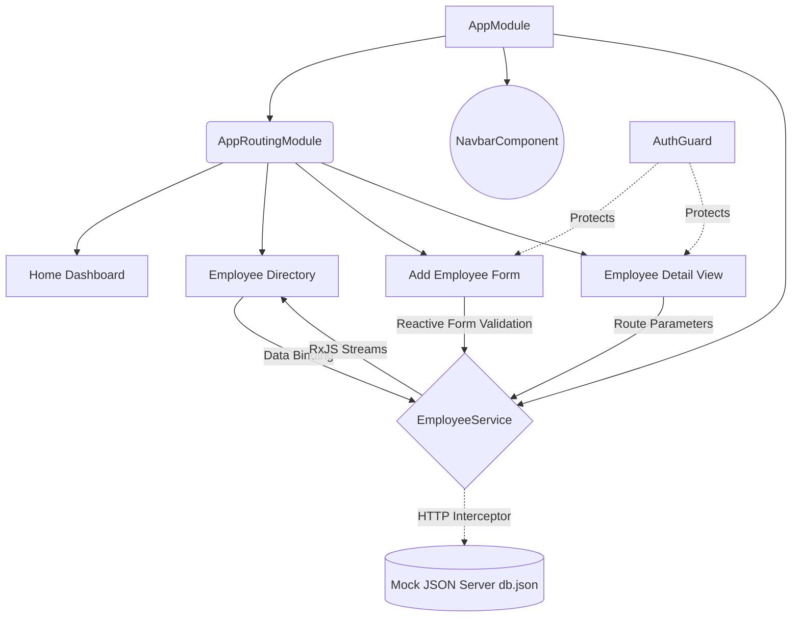

# 👥 Isekai Employee Management Dashboard: Enterprise Edition

A breathtaking, premium **Dark Mode SaaS Employee Management Dashboard** engineered with **Angular 17+** and **TypeScript**. Designed for modern, hyper-growth enterprise ecosystems, this project demonstrates an advanced mastery of scalable Angular architecture, reactive programming paradigms, robust data modeling, and stunning UI/UX design featuring custom glassmorphism, micro-animations, and a highly polished, professional color palette.

Built to handle complex organizational hierarchies seamlessly, this application is a testament to how elite engineering and pixel-perfect design converge to produce million-dollar user experiences.

---

## 👨‍💻 Engineering Core
Meet the principal developers and software architects behind this masterpiece:
- **PULI BALAJI YASHWANTH REDDY**
- **JINS THOMAS**
- **ANUSHKA PRAVAKAR**
- **NEVITA SHARON Y**

---

## 🏗️ Enterprise Architecture Overview
The application is structured into decoupled, highly modular components guided by Angular's sophisticated dependency injection system. It leverages a strictly unidirectional data flow, managing complex application state via comprehensive RxJS Observables attached to resilient external APIs.



---

## 🎯 Executive Value & Key Features
### 1. Angular Fundamentals & Scalable Architecture
- **Strict Data Modeling & TypeScript Safety**: Powered by a robust, deeply typed `Employee` interface that eliminates runtime data anomalies.
- **Service-Oriented Architecture (SOA)**: The centralized `EmployeeService` handles rigorous business logic, resilient HTTP communication, and Dependency Injection across the entire application ecosystem.
- **Smart Routing & Security**: Incorporates dynamic route parameters to load specific executive staff details on demand, heavily fortified by Route Guards (`AuthGuard`) to protect additive and destructive administrative routes.

### 2. Premium Design System (SaaS Dark Mode)
- **Glassmorphism & Depth**: Floating navbars and frosted, layered card components utilizing deep, immersive slate backdrops that reduce executive eye strain.
- **Top-Tier Typography Engine**: Beautiful contrast and readability driven by 'Outfit' and 'Inter' Google Fonts paired flawlessly with Material Symbols Rounded.
- **Micro-Animations**: Smooth, 60fps hover transitions, reactive scaling metric cards, and tactile focus rings that breathe life into the UI.

### 3. Advanced Dynamic Controls & Operations
- **Interactive Directory Engine**: A highly robust `MatTable` featuring instant, debounced Search filtering, Department dropdown isolation, and blazing-fast interactive column Sorting (Name / Compensation).
- **Zero-Friction Inline Row Editing**: Instantly modify team salaries and critical department allocations directly inside the data ledger via a custom, secure save/cancel transaction flow.
- **Custom Directives & Analytics**: Automatically highlights high-net earners intelligently using a tailored `[appHighSalary]` attribute directive synced perfectly with dark mode context colors.
- **Military-Grade Form Excellence**: Highly responsive additive operations featuring comprehensive validation rules, real-time error messages, and a uniquely stylized Indian Rupee (₹) monetary input.

### 4. Implementation Snippets

#### **State Management & HTTP Interception (RxJS)**
The `EmployeeService` handles global state and HTTP calls, acting as the Single Source of Truth for the dashboard components.
```typescript
@Injectable({ providedIn: 'root' })
export class EmployeeService {
  private apiUrl = 'http://localhost:3000/employees';
  private employeeList = new BehaviorSubject<Employee[]>([]);
  employees$ = this.employeeList.asObservable(); // Reactive Stream

  constructor(private http: HttpClient) {
    this.fetchEmployees();
  }

  fetchEmployees(): void {
    this.http.get<Employee[]>(this.apiUrl).subscribe(data => {
      this.employeeList.next(data); // Multicast state change
    });
  }

  addEmployee(employee: Employee): Observable<Employee> {
    const current = this.employeeList.value;
    employee.id = current.length > 0 ? Math.max(...current.map(e => e.id)) + 1 : 1;
    
    return this.http.post<Employee>(this.apiUrl, employee).pipe(
      tap(() => this.fetchEmployees()) // Refresh state automatically on success
    );
  }
}
```

#### **Custom Attribute Directives**
We use `appHighSalary` to dynamically style specific nodes within our components without repeating complex component-level CSS logic.
```typescript
@Directive({
  selector: '[appHighSalary]',
  standalone: false
})
export class HighSalaryDirective implements OnInit {
  @Input('appHighSalary') salary: any;

  constructor(private el: ElementRef) {}

  ngOnInit() {
    if (Number(this.salary) >= 100000) {
      this.el.nativeElement.style.backgroundColor = 'rgba(239, 68, 68, 0.15)'; 
      this.el.nativeElement.style.color = '#fca5a5';
      this.el.nativeElement.style.borderLeft = '4px solid #ef4444';
    }
  }
}
```

#### **Secure Routing Setup**
The application employs smart routing. Notice how `AuthGuard` is passed into `canActivate` to protect the form.
```typescript
const routes: Routes = [
  { path: '', redirectTo: 'home', pathMatch: 'full' },
  { path: 'home', component: Home },
  { path: 'database', component: EmployeeList },
  { path: 'add-employee', component: AddEmployee, canActivate: [AuthGuard] },
  { path: 'employee/:id', component: EmployeeDetail }
];
```

#### **Reactive Form Declarations**
Forms are highly strictly typed and explicitly validated using `FormBuilder`.
```typescript
ngOnInit(): void {
  this.empForm = this.fb.group({
    name: ['', [Validators.required, Validators.minLength(3)]],
    email: ['', [Validators.required, Validators.email, Validators.pattern('^[a-z0-9._%+-]+@[a-z0-9.-]+\\.[a-z]{2,4}$')]],
    role: ['', [Validators.required]],
    department: ['', [Validators.required]],
    salary: ['', [Validators.required, Validators.min(1000)]]
  });
}
```

#### **Custom Transformation Pipes**
`DeptFilterPipe` provides declarative array filtering directly inside the component template bindings without cluttering the controller logic.
```typescript
@Pipe({
  name: 'deptFilter',
  standalone: false
})
export class DeptFilterPipe implements PipeTransform {
  transform(employees: Employee[], department: string): Employee[] {
    if (!employees || !department) return employees;
    return employees.filter(emp => emp.department === department);
  }
}
```

#### **Global HTTP Error Handling (Interceptors)**
The application maintains robustness by catching API breakdowns centrally via an `HttpInterceptor`, preventing the UI from locking up silently.
```typescript
@Injectable()
export class ErrorInterceptor implements HttpInterceptor {
  intercept(request: HttpRequest<any>, next: HttpHandler): Observable<HttpEvent<any>> {
    return next.handle(request).pipe(
      catchError((error: HttpErrorResponse) => {
        let errorMessage = 'An error occurred';
        if (error.error instanceof ErrorEvent) {
          errorMessage = `Error: ${error.error.message}`;
        } else {
          errorMessage = `Error Code: ${error.status}\\nMessage: ${error.message}`;
        }
        console.error(errorMessage);
        return throwError(() => new Error(errorMessage));
      })
    );
  }
}
```

---

## 💻 Tech Stack
| Category     | Technology          |
|--------------|---------------------|
| **Core** | Angular 17+, TypeScript |
| **Styling**   | Custom CSS3, Angular Material |
| **Logic** | RxJS, Reactive Forms, HttpClient |
| **Backend API** | JSON Server |
| **Environment** | Node.js, Angular CLI |

---

## 🚀 Local Installation & Setup

You will need to run two terminal processes simultaneously to launch this application fully: one for the Mock Backend Database, and one for the Angular Frontend.

### **Phase 1: Backend Setup (JSON Server)**
1. **Navigate to the project directory**
   ```bash
   cd employee-dashboard-angular
   ```
2. **Install global JSON server** (If not already installed)
   ```bash
   npm install -g json-server
   ```
3. **Start the database server**
   ```bash
   json-server --watch db.json --port 3000
   ```
   *The mock API will now be listening for CRUD operations on port `3000`.*

### **Phase 2: Frontend Setup (Angular)**
1. **Open a new (second) terminal window** in the same project directory.
2. **Install all Angular dependencies**
   ```bash
   npm install
   ```
3. **Start the Angular Development Server**
   ```bash
   ng serve -o
   ```
   *The application will compile and automatically open in your default browser at `http://localhost:4200/`.*
