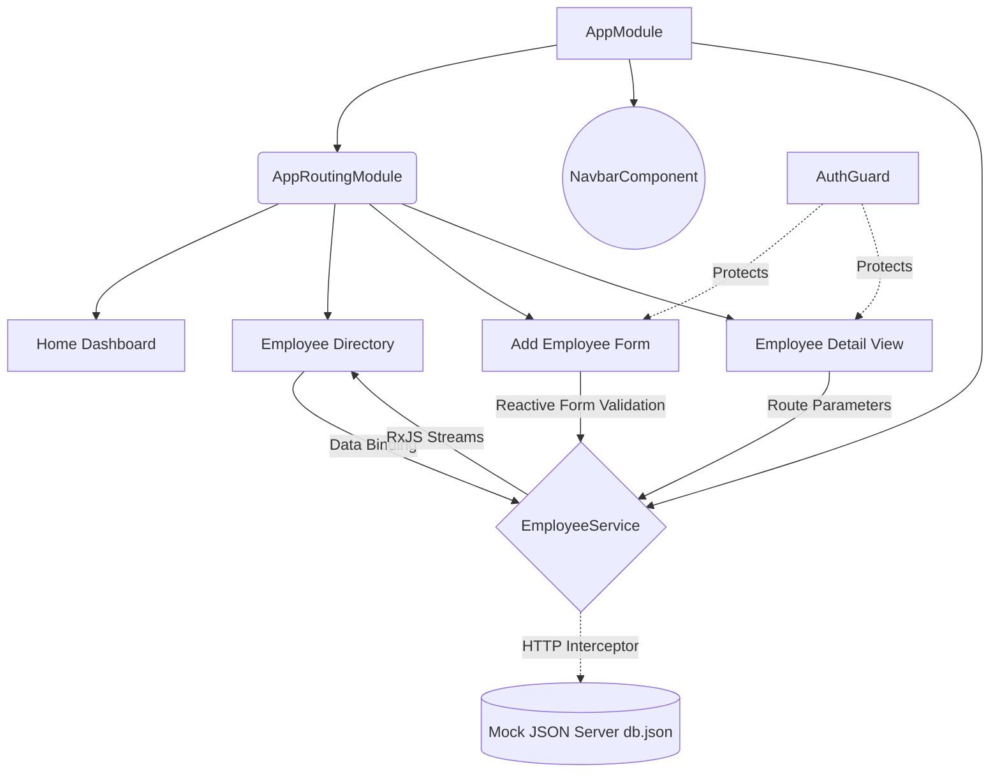

# 👥 Isekai Employee Management Dashboard

A breathtaking, premium **Dark Mode SaaS Employee Management Dashboard** crafted with **Angular 17+** and **TypeScript**. This project demonstrates an advanced mastery of Angular architecture, reactive programming, robust data modeling, and stunning UI/UX design featuring custom glassmorphism, micro-animations, and a highly polished color palette.

---

## 👨‍💻 Team Details
Meet the developers behind this masterpiece:
- **PULI BALAJI YASHWANTH REDDY**
- **JINS THOMAS**
- **ANUSHKA PRAVAKAR**
- **NEVITA SHARON Y**

---

## 🏗️ Architecture Overview
The application is structured into modular components guided by Angular's dependency injection system, managing state via RxJS Observables attached to an external JSON server API.



---

## 🎯 Key Features & UX
### 1. Angular Fundamentals & Architecture
- **Strict Data Modeling**: Powered by a robust `Employee` interface.
- **Service-Oriented Architecture**: `EmployeeService` handles all business logic, HTTP communication, and Dependency Injection across components.
- **Smart Routing**: Incorporates dynamic route parameters to load specific staff details, alongside Route Guards (`AuthGuard`) protecting additive routes.

### 2. Premium Design System (SaaS Dark Mode)
- **Glassmorphism**: Floating navbar and frosted card components utilizing deep slate backdrops.
- **Top-Tier Typography**: Beautiful contrast driven by 'Outfit' and 'Inter' Google Fonts paired with Material Symbols Rounded.
- **Micro-Animations**: Smooth hover transitions, scaling metric cards, and focus rings.

### 3. Advanced Dynamic Controls
- **Interactive Directory**: A robust `MatTable` featuring instant Search filtering, Department dropdown isolation, and interactive column Sorting (Name / Compensation).
- **Inline Row Editing**: Instantly modify team salaries and department allocations directly inside the data list via a custom save/cancel flow.
- **Custom Directives**: Highlights high-net earners using a tailored `[appHighSalary]` attribute directive synced with dark mode colors.
- **Form Excellence**: Highly responsive additive forms featuring comprehensive validation rules, real-time error messages, and a uniquely stylized Indian Rupee (₹) compensation input.

---

## 💻 Tech Stack
| Category     | Technology          |
|--------------|---------------------|
| **Core** | Angular 17+, TypeScript |
| **Styling**   | Custom CSS3, Angular Material |
| **Logic** | RxJS, Reactive Forms, HttpClient |
| **Backend API** | JSON Server |
| **Environment** | Node.js, Angular CLI |

---

## 🚀 Local Installation & Setup

You will need to run two terminal processes simultaneously to launch this application fully: one for the Mock Backend Database, and one for the Angular Frontend.

### **Phase 1: Backend Setup (JSON Server)**
1. **Navigate to the project directory**
   ```bash
   cd employee-dashboard-angular
   ```
2. **Install global JSON server** (If not already installed)
   ```bash
   npm install -g json-server
   ```
3. **Start the database server**
   ```bash
   json-server --watch db.json --port 3000
   ```
   *The mock API will now be listening for CRUD operations on port `3000`.*

### **Phase 2: Frontend Setup (Angular)**
1. **Open a new (second) terminal window** in the same project directory.
2. **Install all Angular dependencies**
   ```bash
   npm install
   ```
3. **Start the Angular Development Server**
   ```bash
   ng serve -o
   ```
   *The application will compile and automatically open in your default browser at `http://localhost:4200/`.*
